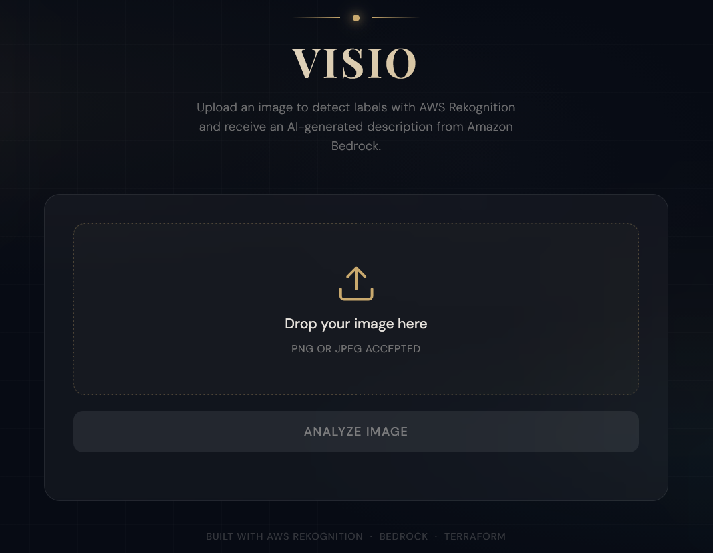
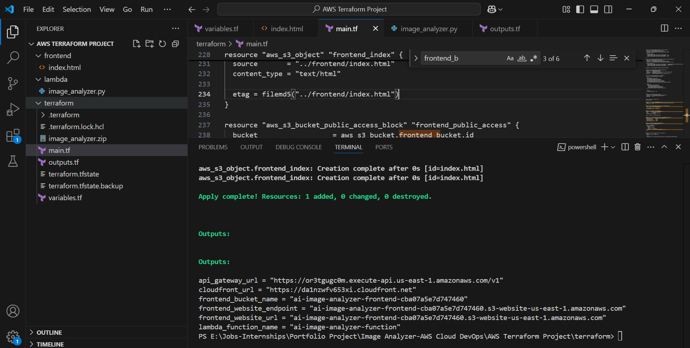
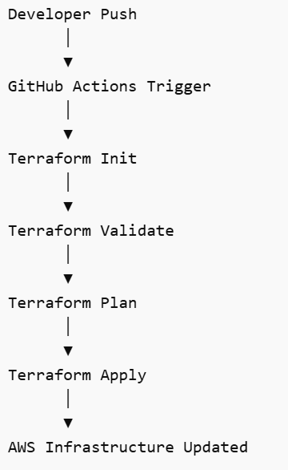

# 📺 AI-Powered Image Analyzer on AWS using Terraform, Rekognition & Amazon Bedrock

## 🧠 Project Overview 

**🚀 Live Demo:**

https://da1nzwfv653xi.cloudfront.net/

This project demonstrates how to design and deploy a **serverless AI-powered image analysis application** using modern **cloud-native architecture and Infrastructure as Code (IaC)**. 

The system allows users to upload an image through a web interface, automatically detects objects using **AWS Rekognition**, and generates a natural-language description using **Amazon Bedrock (Mistral LLM)**. The entire infrastructure is provisioned using **Terraform** and automatically deployed using **GitHub Actions CI/CD**. 

This project reflects practical experience in building **end-to-end AI-powered cloud applications**, integrating AI services, serverless compute, and automated infrastructure deployment.

---

## ⭐ Key Highlights

  -Built a **serverless AI application** using **AWS Rekognition + Amazon Bedrock**

  -Designed a **scalable cloud architecture** using **API Gateway, Lambda, S3, and CloudFront**

  -Implemented **Infrastructure as Code (IaC) using Terraform**

  -Automated deployments using **GitHub Actions CI/CD**

  -Deployed a live production demo on **AWS CloudFront CDN**

---

## 🎯 Project Goals

  -Build an **AI-powered image analysis application**
  
  -Deploy a **serverless architecture on AWS**
  
  -Automate infrastructure using **Terraform**
  
  -Implement **CI/CD pipeline using GitHub Actions**
  
  -Demonstrate **cloud architecture design principles**
  
  -Deliver a **scalable, low-maintenance AI solution**

---

## 🧰 Technologies Used

### ☁️ Cloud Services 
| Service                      | Purpose                           |
| ---------------------------- | --------------------------------- |
| **Amazon S3**                | Hosts the frontend static website |
| **Amazon CloudFront**        | CDN for fast global delivery      |
| **AWS Lambda**               | Backend processing logic          |
| **Amazon API Gateway**       | Exposes the REST API              |
| **AWS Rekognition**          | Image label detection             |
| **Amazon Bedrock (Mistral)** | AI description generation         |
| **AWS IAM**                  | Role and permission management    |

### ⚙️ DevOps & Infrastructure
| Tool               | Purpose                |
| ------------------ | ---------------------- |
| **Terraform**      | Infrastructure as Code |
| **GitHub Actions** | CI/CD automation       |
| **Git**            | Version control        |

### 💻 Programming & Frontend
| Technology                  | Purpose                        |
| --------------------------- | ------------------------------ |
| **Python**                  | Lambda backend                 |
| **HTML / CSS / JavaScript** | Web interface                  |
| **JSON API**                | Frontend–backend communication |

---

## 🏗️ Architecture Diagram
Below is the system architecture illustrating how the application processes images and generates AI insights.

## 🏗️ Architecture Design Principles 
The system was designed following modern cloud architecture best practices:

  -**Serverless-first architecture** to minimize infrastructure management

  -**Decoupled frontend and backend layers**

  -**Infrastructure as Code (IaC)** for reproducible deployments

  -**Event-driven processing using AWS Lambda**

  -**Global content delivery through CloudFront CDN**

  -**Secure service communication via IAM roles**

---

## 🔄 System Workflow

1. **User Uploads Image**
   
  The user uploads an image through the web application hosted on **Amazon S3**.

3. **CloudFront Delivers Frontend**  

  CloudFront provides:
 
    -global CDN delivery

     -HTTPS support

     -improved frontend performance

4. **API Gateway Receives Request**

  The frontend sends the image as a base64 payload to **POST /analyze**. 

5. **Lambda Processes Image**

  Lambda performs:

      -Base64 decoding

     -Image processing

     -Rekognition API calls

     -Bedrock LLM prompt generation
 
7. **Rekognition Detects Labels**

Example detected labels:

    -Dog
    
    -Border Collie
    
    -Grass
    
    -Field
    
    -Outdoor
    
    -Sky

9. **Bedrock Generates Description**

Using the labels, Bedrock generates a natural-language description:

     -A Border Collie running through a green field with yellow flowers under a blue sky.

10. **Results Returned to Frontend**  

The Lambda function returns:
    **{
      "labels": [...],
      "description": "..."
    }**
   
---

## 🚀 Application Demo
The application is fully deployed on AWS and accessible through **Amazon CloudFront**.

👉 **Try the application here:**

https://da1nzwfv653xi.cloudfront.net/

---

## 🌍 Live Deployment Architecture

The application is deployed using the following cloud infrastructure:

  -Frontend Hosting → **Amazon S3**
  
  -CDN Delivery → **Amazon CloudFront**
  
  -API Layer → **Amazon API Gateway**
  
  -Compute Layer → **AWS Lambda**
  
  -AI Services → **Rekognition + Bedrock**
  
  -Infrastructure Provisioning → **Terraform**
  
  -Deployment Automation → **GitHub Actions**
  
---

## ⚙️ Infrastructure as Code (Terraform)

All infrastructure resources are created using Terraform.

Terraform provisions:

    -IAM roles & policies
  
    -Lambda function deployment
  
    -API Gateway REST API
  
    -Lambda permissions
  
    -S3 static website hosting
  
    -CloudFront CDN
  
    -Terraform outputs for endpoints

Example IaC flow:

This ensures:

    -reproducible infrastructure
  
    -automated deployments
  
    -version-controlled cloud resources

---

## 🔄 CI/CD Pipeline (GitHub Actions)

The project includes a GitHub Actions workflow that automatically deploys infrastructure.

Pipeline workflow:
          

Benefits:
  
    -automated infrastructure deployment
  
    -reproducible environments
  
    -DevOps best practices
  
    -secure secret management

    ---

## 💡 Why This Project Matters

Organizations manage massive volumes of image data but often rely on manual tagging and description generation. This solution demonstrates how **AI + cloud infrastructure** can automate image understanding and support:

  -automated media tagging

  -AI-powered product description generation

  -accessibility improvements for visual content

  -intelligent digital asset management systems

 ---
 
## 🚀 Future Enhancements

Possible improvements include:

  -Upload images directly to S3 instead of base64 encoding

  -Add authentication using Amazon Cognito

  -Implement CloudWatch monitoring dashboards

  -Support multiple image uploads

  -Optimize LLM prompts for richer descriptions

  -Add image storage and retrieval functionality

 ---
    
**⭐ If you find this project interesting, feel free to star the repository or connect with me to discuss cloud, AI, and data engineering solutions.**
